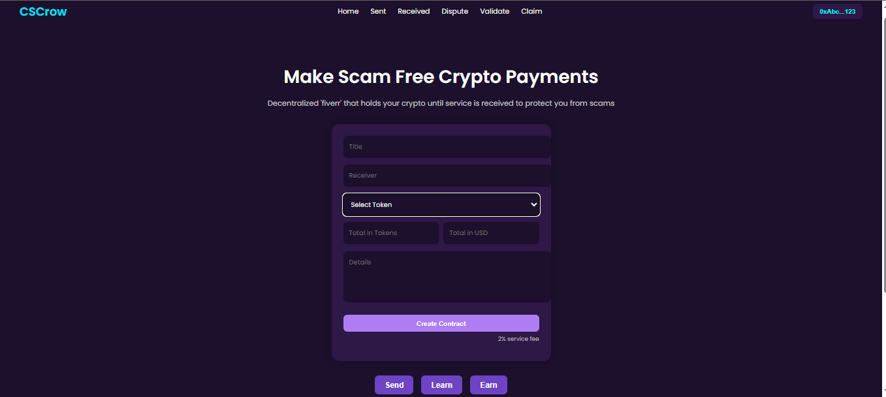

# 🛡️ Escrow DApp

A simple decentralized escrow application (DApp) built using React for the frontend and Solidity for smart contracts. This project demonstrates how you can create secure, trustless transactions between two parties using blockchain.



---

## ✨ Features

- Connect MetaMask wallet
- Enter depositor, arbiter, and beneficiary addresses
- Deploy escrow contract to blockchain
- Approve funds release with one-click
- Dark mode modern UI

---

## 🚀 Tech Stack

- **Frontend:** React, CSS (custom)
- **Blockchain:** Solidity, Hardhat
- **Wallet:** MetaMask
- **Web3 Integration:** Ethers.js

---

## 🛠️ Getting Started

### Prerequisites

- Node.js & npm
- MetaMask wallet
- Git
- Hardhat (`npm install --save-dev hardhat`)

### Installation

```bash
# Clone the repo
git clone https://github.com/maliktoheed123/Escrow-Dapp.git

# Go into the project
cd escrow-dapp/client

# Install frontend dependencies
npm install

# Start the frontend
npm start
