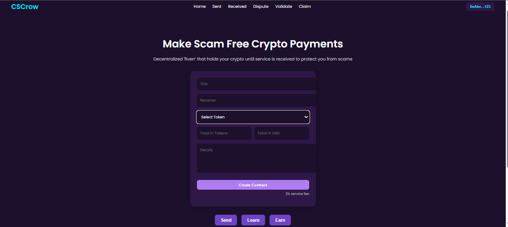

# Escrow DApp 💰

A decentralized application (DApp) that facilitates secure escrow transactions between two parties using smart contracts on the blockchain.

## Features
- Connect MetaMask wallet
- Enter buyer, seller, and arbiter addresses
- Deploy escrow contract
- Simple and intuitive UI (dark mode)

## Technologies Used
- React.js
- Ethereum Smart Contracts (Hardhat)
- MetaMask
- Ethers.js
